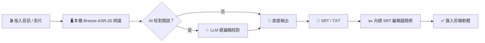
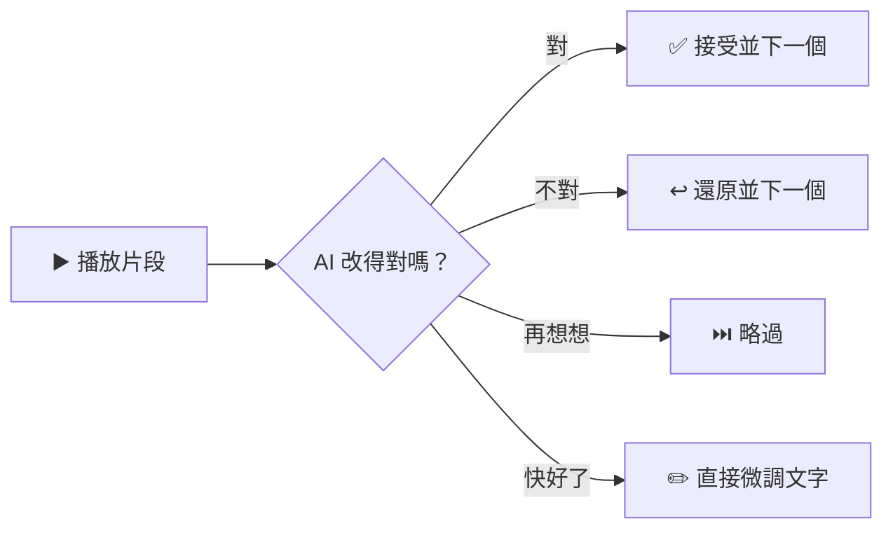
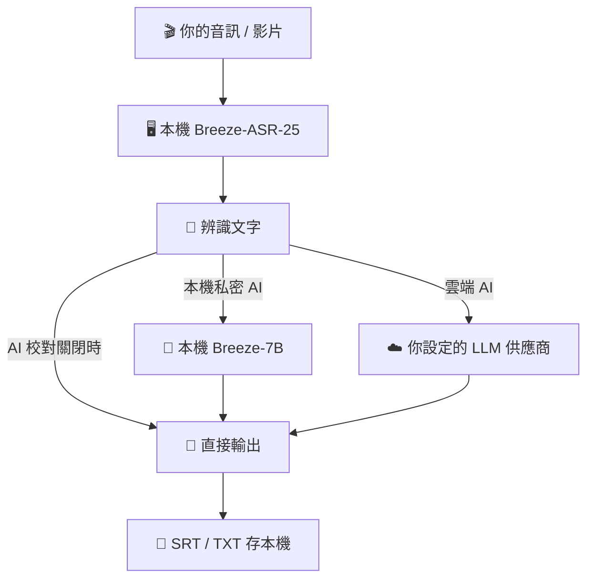

<p align="center">
  
</p>

<h1 align="center">聲文去 SanWich — 台灣繁體中文語音轉文字工具</h1>

<p align="center">
  給台灣影片工作者、剪輯師、記者、內容創作者的 Windows 桌面工具：<br>
  丟進音訊或影片，本機 Breeze-ASR-25 辨識，AI 總編輯校對，直接產出接近可交付的 SRT 字幕。
</p>

<p align="center">
  <strong>台灣繁體中文語音轉文字</strong>｜<strong>SRT 字幕產生器</strong>｜<strong>Breeze-ASR-25 GUI</strong>｜<strong>AI 字幕校對</strong>｜<strong>訪談逐字稿</strong>
</p>

---

## 🎯 一句話說明

SanWich 不是雲端訂閱服務，也不是會議記錄平台。

它只做一件事：**把你的音訊或影片，在你自己的電腦上轉成第一次辨識就盡量接近可交付的繁體中文逐字稿與 SRT 字幕。** 辨識在本機完成，AI 校對可開可關，改完直接在內建編輯器精修。

適合這些場景：

| 場景 | 你丟進來的 | SanWich 給你的 |
| --- | --- | --- |
| 🎬 影片剪輯 | 訪談毛片音軌 | 可直接匯入剪輯軟體的 SRT 字幕 |
| 🎙️ 訪談整理 | 一兩小時的訪談錄音 | 逐字稿 TXT（可選語者標註） |
| 📰 新聞採訪 | 記者會、電訪錄音 | 校對過的引述文字 |
| 📚 教學內容 | 課程、講座錄影 | 字幕＋逐字稿雙輸出 |

---

## 🧭 它怎麼工作



語音辨識全程在你的電腦上跑（支援 GPU 加速，無 GPU 自動用 CPU）。AI 校對可選「本機私密 AI」；只有主動選擇 Gemini、OpenAI、Claude 或 DeepSeek 時，辨識後的文字才會送往該雲端供應商。

---

## ✨ 核心能力

| 圖示 | 能力 | 解決的問題 |
| --- | --- | --- |
| 🖥️ | 本機語音辨識 | Breeze-ASR-25 專為台灣中文優化，音檔不離開你的電腦 |
| 🔐 | 本機私密 AI | Breeze-7B＋llama.cpp 在本機校對，字幕與 Prompt 不上傳 |
| ✨ | AI 總編輯校對 | 套用「總編輯 Prompt」修同音錯字、贅字，SRT 結構鎖死不亂動 |
| ✂️ | SRT 字幕編輯器 | 波形時間軸、拖拉調整、切割合併、尋找取代，不用再開別的軟體 |
| 🔁 | 快速對照 | 逐段播放、核對 AI 改了什麼，一鍵接受或還原 |
| 🧠 | 個人化規則庫 | 從你的手動修改自動學規則，越用越懂你的用字習慣 |
| 🗣️ | 語者分離 | TXT 逐字稿可標註語者（指定 2–6 人） |
| 📦 | 批次處理 | 多個檔案排隊自動跑完 |
| 🀄 | 全中文錯誤訊息 | API 錯誤（額度、限流、金鑰失效）全部翻成人話 |

---

## ✂️ 內建 SRT 編輯器

辨識完不用換軟體，直接精修：

- **波形時間軸**：看著波形拖拉字幕塊 IN/OUT 點，playhead 跟隨播放
- **低延遲播放**：常駐音訊串流以 DAC 時鐘同步波形，改善舊 HDD 電腦的聲音延遲
- **切割 / 合併 / 刪除**：剪刀切割自動重排序號、多選合併、Delete 刪除
- **尋找取代**：Ctrl+F / Ctrl+H，統一修正重複錯字
- **狀態標色**：AI 修改過的字幕標橘色、時間軸異常標紅色，一眼看出要檢查哪裡
- **快捷操作**：Ctrl+滾輪縮放時間軸、上下鍵跳字幕 IN/OUT、Ctrl+Z 復原、Ctrl+Shift+Z 重做
- **匯入外部 SRT**：別處產生的字幕也能拉進來修

## 🔁 快速對照：懶人核對 AI 修改

AI 改過的每一段，逐段播放原音檔片段給你聽：



不用整份重聽，只核對有被改動的地方。

## 🧠 個人化規則庫：越用越懂你

你在編輯器裡的每次手動修正，SanWich 會自動整理成「before → after」規則候選：

- 匯出時彈出建議清單，勾選要收進規則庫的（可分領域：通用 / 訪談 / 新聞 / 科技 / 教學）
- 下次 AI 校對時自動把你的規則注入 Prompt，同樣的錯不用改第二次
- 自動追蹤採納率，久未使用的規則自動冷凍、相似規則自動合併，規則庫不會無限膨脹
- 規則存在本機 `%APPDATA%\SanWich\personal_rules.json`，更新程式不會覆寫，也不會上傳

---

## 💛 Free / Supporter

SanWich 的核心功能會持續免費開源。

Free 版包含完整的單檔字幕工作流：本機語音辨識、AI 校對、SRT/TXT 輸出與基本字幕編輯器。

Supporter 版提供 30 天完整試用。試用結束後，SanWich 會回到 Free 模式，核心功能仍可繼續使用。

Supporter 版是支持 SanWich 持續開發的方式。作為感謝，Supporter 會解鎖一些重度使用者更需要的省時間功能，例如批次處理、AI 修改快速對照完整版與個人化規則庫。

| 功能 | Free | Supporter |
| --- | :---: | :---: |
| 單檔音訊 / 影片轉 SRT / TXT | ✅ | ✅ |
| 本機 Breeze-ASR-25 辨識 | ✅ | ✅ |
| AI 總編輯校對 | ✅ | ✅ |
| SRT 字幕編輯器、尋找取代、匯入外部 SRT | ✅ | ✅ |
| DaVinci Tools | ✅ | ✅ |
| 批次處理 | 🔒 | ✅ |
| AI 修改快速對照完整版 | 🔒 | ✅ |
| 個人化規則庫 | 🔒 | ✅ |
| 語者分離（TXT 標註語者） | 🔒 | ✅ |

SanWich 採用信任制授權。授權機制只做基本驗證與提醒，不會強制登入、不連網驗證，也不會因為授權問題鎖住 Free 功能。

👉 支持開發：[portaly.cc/WiKiVibe](https://portaly.cc/WiKiVibe)

---

## 🔐 資料與隱私



| 資料 | 去向 |
| --- | --- |
| 🎬 音訊 / 影片 | **不上傳**，辨識全程在本機 |
| 📝 辨識後文字 | 本機模式只送到 `127.0.0.1`；只有選擇雲端 AI 才送往該供應商 |
| 🧠 個人化規則庫 | 本機 |
| 🕘 編輯歷史 | 本機 |
| 🔑 API Key | 本機 `%APPDATA%\SanWich\config.json`（更新程式不會覆寫） |

---

## ⚙️ 推薦配置

| 項目 | 建議 | 說明 |
| --- | --- | --- |
| 🖥️ GPU | NVIDIA 顯卡 | 安裝腳本自動偵測並安裝對應 CUDA 版 PyTorch；本機模式會先跑完 ASR、釋放顯存後才啟動 LLM；無 GPU 自動退回 CPU（速度較慢） |
| ✨ LLM | 本機 Breeze-7B | 不需 API Key；首次使用下載約 4.54GB GGUF 與 llama.cpp runtime |
| 💾 硬碟 | 本機 AI 建議預留 10 GB 以上 | 首次下載最低需要 7GB 可用空間；ASR 約 3–4GB，本地 LLM 模型約 4.54GB，另需 runtime 與快取空間 |

API Key 申請步驟見 [`docs/申請API_Key教學.md`](./docs/申請API_Key教學.md)。

---

## 🚀 安裝與使用

### 一般使用者安裝

請到右側 **Releases** 下載最新版 `SanWich_setup_v版本號.zip`，完整解壓縮後執行：

目前開發版更新內容見 [`docs/更新紀錄_v2.5b.md`](./docs/更新紀錄_v2.5b.md)。

```bat
01_setup.bat
```

腳本會建立 `.venv`、偵測 GPU 並安裝對應版本 PyTorch 與必要套件。


### 開始使用

1. 安裝完成後執行 `02_launch.bat`
2. 把音訊或影片拖進主視窗
3. 勾選輸出格式（SRT / TXT），決定是否開啟 AI 校對
4. 按開始，等辨識完成
5. 用內建編輯器精修，匯出

### 從原始碼執行

開發者可 clone 專案後在根目錄執行 `01_setup.bat`，再執行 `02_launch.bat`。打包、測試與診斷工具集中放在 [`scripts`](./scripts) 目錄，一般使用者不需要操作。

---

## 🧱 產品邊界

SanWich 刻意不做這些事情：

| 不做 | 原因 |
| --- | --- |
| ❌ 雲端辨識 | 主線是本機 ASR，音檔不離開你的電腦 |
| ❌ 多語言 | 先把台灣繁體中文做到最好 |
| ❌ 會議記錄平台 | 專注轉檔工作流，不做摘要、待辦、協作 |
| ❌ 內容擴寫 | 總編輯 Prompt 鎖死 SRT 結構，只修錯不編造你沒說的話 |
| ❌ 即時聽打 | 定位是檔案轉逐字稿，不是即時輸入工具 |

---

## 🙏 致謝 / Inspired By

- [mtkresearch/Breeze-ASR-25](https://github.com/mtkresearch/Breeze-ASR-25) — 聯發科創新基地的台灣中文語音辨識模型（Apache 2.0），本專案的辨識主力。
- [ji4/subdesk](https://github.com/ji4/subdesk) — 快速對照、AI 校對結果核對流程與字幕修改標示的設計靈感來源。

---

## ⭐ Star

如果這個工具幫你省下了修字幕的時間，歡迎點個 Star 支持繼續開發。

●●●歡迎請喝飲料●●●
https://portaly.cc/WiKiVibe

---
## 回饋與問題回報
如果遇到錯誤、安裝失敗，或想建議功能，請到 GitHub Issues 留言
